# Vinicius Azevedo

### Dados • BI • Machine Learning

---

## 👨‍💻 Sobre mim

Sou estudante de **Análise e Desenvolvimento de Sistemas**, construindo minha formação com foco em **Dados, Business Intelligence e Machine Learning**.

Atualmente estou fortalecendo minha base em **Python, SQL e Pandas**, desenvolvendo gradualmente minhas habilidades em análise e manipulação de dados.

Este perfil acompanha minha evolução na área de tecnologia — dos fundamentos aos projetos que serão desenvolvidos ao longo dessa jornada.

- 🎓 Estudante de **Análise e Desenvolvimento de Sistemas**
- 📊 Foco em **Dados e Business Intelligence**
- 🤖 Objetivo de longo prazo: **Machine Learning**
- 🐍 Estudando **Python, SQL e Pandas**
- 📚 Novas tecnologias serão adicionadas conforme avanço nos estudos

---

## 🛠️ Tecnologias

  

---

## 🔥 Minha atividade no GitHub

---

## 📊 Estatísticas

---

## 🐍 Contribuições

---

## 🌐 Contato

---

### `while learning: keep_going()`

Construindo conhecimento, um commit de cada vez.

