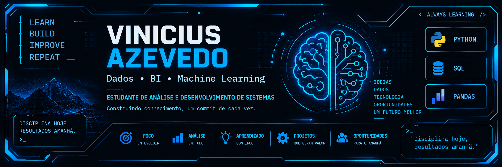
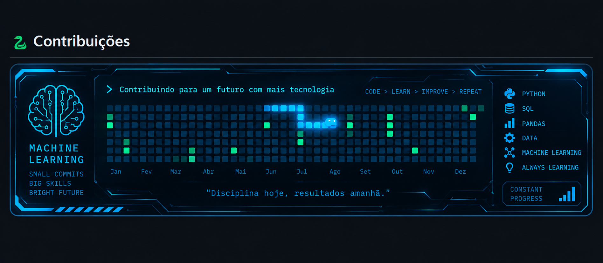

<!-- ===================================================== -->
<!--                 VINICIUS AZEVEDO                      -->
<!-- ===================================================== -->

 

---

## 👨‍💻 Sobre mim

Sou estudante de **Análise e Desenvolvimento de Sistemas**, construindo minha formação com foco em **Dados, Business Intelligence e Machine Learning**.

Atualmente estou fortalecendo minha base em **Python, SQL e Pandas**, desenvolvendo gradualmente minhas habilidades em análise e manipulação de dados.

Este perfil acompanha minha evolução na área de tecnologia — dos fundamentos aos projetos que serão desenvolvidos ao longo dessa jornada.

- 🎓 Estudante de **Análise e Desenvolvimento de Sistemas**
- 📊 Foco em **Dados e Business Intelligence**
- 🤖 Objetivo de longo prazo: **Machine Learning**
- 🐍 Estudando **Python, SQL e Pandas**

---

## 🛠️ Tecnologias

  

`PYTHON` • `SQL` • `PANDAS` • `DATA`

---

## 🔥 Minha atividade no GitHub

---

## 📊 Estatísticas

---

## 🧠 Evolução

---

## 🌐 Contato

---

### `while learning: keep_going()`

**Construindo conhecimento, um commit de cada vez.**

`LEARN` • `BUILD` • `IMPROVE` • `REPEAT`

